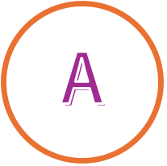
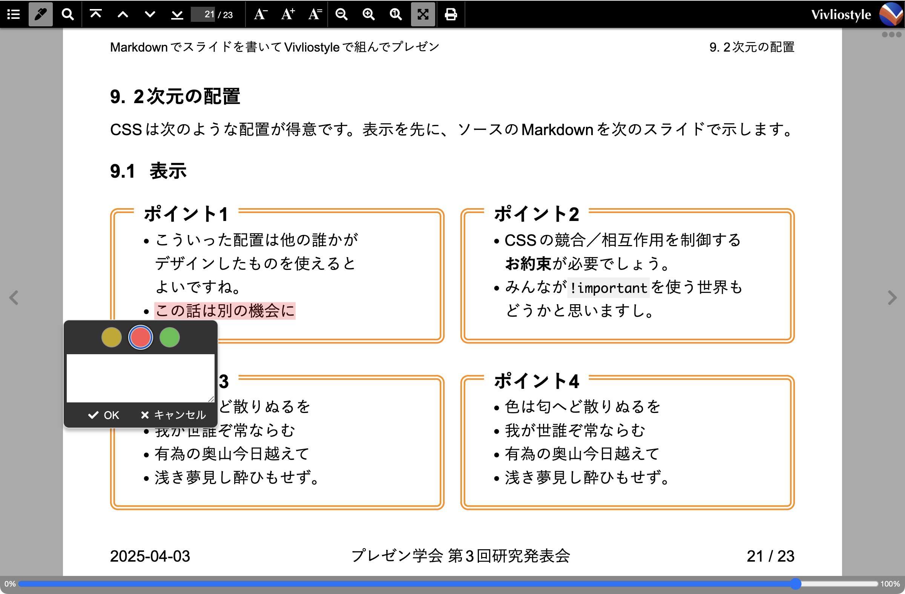

# Markdownでスライドを書いてVivliostyleで組んでプレゼン #

## 表紙{.cover}

### 研究会{.conference}

プレゼン学会 第3回研究発表会

### 著者{.author}

yamahige

### 版一覧{.version-list}

#### 版{.version}

##### 版名{.version-name}

v2

##### 日付{.date}

2025-04-03

#### 版{.version}

##### 版名{.version-name}

v1

##### 日付{.date}

2025-03-17

## はじめに

研究会発表のスライドを想定して、HTML+CSSでスライドを作る場合の嬉しいところをあげてみます。

- 学会の研究会での発表ならば、元になる論文／予稿があって、主張をテキストで表現できています
- ヘッダーやフッターに挿入する項目（「日付」、「研究会名」、など）や書式（「スライド番号/総スライド数」、など）が研究室などで指導されていたりします

## テキストが図を回り込んでくれる

{style="float: block-start inline-end; float-reference: page; inline-size: 20em;"}

HTML+CSSでは、テキストが図を回り込むのが普通で、特に工夫はいりません。

- なお、改行の位置で「あれ？」と思ったみなさん、自動的な改行の位置を調整できるのです。[別のスライド](#word-break)で説明します。
-	色は匂へど散りぬるを我が世誰ぞ常ならむ有為の奥山今日越えて浅き夢見し酔ひもせず。色は匂へど散りぬるを我が世誰ぞ常ならむ有為の奥山今日越えて浅き夢見し酔ひもせず
-	色は匂へど散りぬるを我が世誰ぞ常ならむ有為の奥山今日越えて浅き夢見し酔ひもせず。色は匂へど散りぬるを我が世誰ぞ常ならむ有為の奥山今日越えて浅き夢見し酔ひもせず
-	色は匂へど散りぬるを我が世誰ぞ常ならむ有為の奥山今日越えて浅き夢見し酔ひもせず。色は匂へど散りぬるを我が世誰ぞ常ならむ有為の奥山今日越えて浅き夢見し酔ひもせず

## 改行位置の調整{#word-break}

CSSでは自動的に折り返される改行の位置を、`word-break`プロパティ[^word-break]を使って調整できます。

[^word-break]: word-break  https://developer.mozilla.org/ja/docs/Web/CSS/word-break

<div style="word-break: normal;">

{style="float: inline-end; inline-size: 17em;"}

`word-break: normal;`という設定では、既定の規則で改行します:

-	HTML+CSSでは、テキストが図を回り込むのが普通です。
-	色は匂へど散りぬるを我が世誰ぞ常ならむ有為の奥山今日越えて浅き夢見し酔ひもせず。

</div>

<div>

{style="clear: both; float: inline-end; inline-size: 17em;"}

`word-break: auto-phrase;`という設定では、日本語として、より自然な位置で改行します。これは好みが分かれるでしょう:

-	HTML+CSSでは、テキストが図を回り込むのが普通です。
-	色は匂へど散りぬるを我が世誰ぞ常ならむ有為の奥山今日越えて浅き夢見し酔ひもせず。

</div>

なお、このスライド全体には、試しに`word-break: auto-phrase;`と設定しています。

## 文字数が均等になるように改行してくれる

- このスライドのタイトルは1行に収まらないくらい長いので自動的に改行しています。自然なところで改行してるように見えますし、ほぼ同じ長さの2行になっています。
- ただし、Markdownを見るとタイトルには改行が入っていません。

<div style="display: flex; flex-direction: column; column-gap: 1em; inline-size: 50%;">

<div class="arrow-t2b">

```md
# Markdownでスライドを書いてVivliostyleで組んでプレゼン #
```
</div>

<div style="word-break: auto-phrase; text-wrap: balance; font-size: large; font-weight: bold; inline-size: 80%; margin-inline: auto; text-align: center;">Markdownでスライドを書いてVivliostyleで組んでプレゼン</div>

</div>

CSSで次の設定を使うと、これを実現できます。

- `word-break: auto-phrase;`で、ことばとして自然なところで改行します。
- `text-wrap: balance;`[^text-wrap]で、行の文字数が均等になるように改行します。

[^text-wrap]: text-wrap https://developer.mozilla.org/ja/docs/Web/CSS/text-wrap

## 約物の前後の空白の詰め

"「"や"（"といった約物が行頭・行末にきたり連続したりする場合の空白の詰めを,
`text-spacing-trim`プロパティ[^text-spacing-trim]で制御できます。

[^text-spacing-trim]: text-spacing-trim https://developer.mozilla.org/ja/docs/Web/CSS/text-spacing-trim

`text-spacing-trim: normal;`で、行頭の約物は詰めませんが、約物が連続するときに詰めます。これが既定値です。

<div style="text-spacing-trim: normal; font-size: 90%;">

> - 「色は匂へど散りぬるを我が世誰ぞ常ならむ有為の奥山今日越えて浅き夢見し酔ひもせず。」
> - ヘッダーやフッターに挿入する項目（「日付」、「研究会名」、など）が研究室などで指導されていたりします

</div>

`text-spacing-trim: trim-both;`で、行頭行末や連続する約物の空白を詰めます。

<div style="text-spacing-trim: trim-both; font-size: 90%;">

> - 「色は匂へど散りぬるを我が世誰ぞ常ならむ有為の奥山今日越えて浅き夢見し酔ひもせず。」
> - ヘッダーやフッターに挿入する項目（「日付」、「研究会名」、など）が研究室などで指導されていたりします

</div>

スライドはテキストが短く箇条書きも多いので、テキストのまとまりは行頭の揃えで見せるのがよいかもしれません。

このスライド全体には`text-spacing-trim: trim-both;`と設定されています

<!--
`text-spacing-trim: space-all;`と設定すると、約物の空白を詰めません。

<div style="text-spacing-trim: space-all; font-size: 90%;">

> - 「色は匂へど散りぬるを我が世誰ぞ常ならむ有為の奥山今日越えて浅き夢見し酔ひもせず。」
> - ヘッダーやフッターに挿入する項目（「日付」、「研究会名」、など）が研究室などで指導されていたりします

</div>
-->

## ヘッダーとフッター

スライド本文のテキストを抜き出して、ヘッダーやフッターに表示できます

- 発表のタイトル（`h1`要素）やセクションの見出し（`##`見出し、つまり`h2`要素など）といった既定のタグの付いたテキスト
- 日付、発表者、研究会名など既定のタグが付いていないテキスト

総スライド数を数えてくれて、その値を自動生成するテキストに含められます

### ヘッダー／フッターはCSSのマージン・ボックス

ヘッダーやフッターを表示するには、CSSのマージン・ボックスを利用します。マージン・ボックスは、`@top-left`や`@bottom-right-corner`など、側面とコーナーの合計16個の場所が定義されています<span class="fn">@page https://developer.mozilla.org/ja/docs/Web/CSS/@page</span><span class="fn">CSS Paged Media Module Level 3 - 5. Page-Margin Boxes https://www.w3.org/TR/css-page-3/#margin-boxes</span><span class="fn">CSS - @page - とほほのWWW入門 https://www.tohoho-web.com/css/rule/page.htm</span>。

<div id="page-margin-table">

| コーナー | | | | コーナー |
|---:|:---:|:---:|:---:|:---|
| top-left-corner | top-left | top-center | top-right | top-right-corner |
| left-top | | | | right-top |
| left-middle | | | | right-middle |
| left-bottom | | | | right-bottom |
| bottom-left-corner | bottom-left | bottom-center | bottom-right | bottom-right-corner |

</div>

### スライド本文のテキストを抜き出して表示

スライド本文から所定のテキストを自動的に抜き出してヘッダーやフッターに表示できると、本文を修正したときの修正漏れを防げます。

これには、CSSの名前付き文字列(named string<span class="fn">1.1. Named strings - CSS Generated Content for Paged Media Module https://www.w3.org/TR/css-gcpm-3/#named-strings</span>)という仕組みを使います。
やり方は大まかに次の手順です:

1. 抜き出したいテキストに印を付ける。「印が付く」=「セレクターで選べる」です
1. その印を手がかりとしてテキストに名前を付ける
1. その名前を使って、表示したい場所にテキストを生成する

次の順に説明します:

1. 発表のタイトルやセクションの見出し
1. 発表のタイトル、日付、発表者、研究会名など

### 発表のタイトルやセクションの見出し

発表タイトルには`h1`、セクションの見出しには`h2`というHTML既定の印(タグ)を付けますね。`h2`見出しを、自動生成した番号付きで各スライドの`@top-right`マージンに表示するとします。

それにはCSSの`string-set`プロパティを使って、生成した番号に、例えば`chapter-number`という名前を、テキストに`chapter`という名前を付けます。

```css
h2 {
    string-set: chapter-number content(before), chapter content();
}
```

`content(before)`は`h2`の`::before`疑似要素の内容を示します。`content()`は`content(text)`という意味で、`h2`のテキストを示します。

そして、`@top-right`マージンの`content`プロパティの値で、`string`関数の中でこれらの名前を使ってテキストを参照します。`first`によって、そのスライド中の最初の見出しを使います。

```css
@page {
    @top-right { content: string(chapter-number, first) " " string(chapter, first); }
}
```

### 日付、発表者、研究会名など - その1

「研究会名」といったHTML既定の印（タグ）はないので、印の工夫から始めます。

Vivliostyle用のMarkdownとして開発されている、VFM (Vivliostyle Flavored Markdown)<span class="fn">[Vivliostyleに特化したMarkdown - VFMの使い方](https://gihyo.jp/article/2024/03/vivliostyle-02)</span>は、Markdownの見出しに応じてsection要素を生成して階層化してくれます<span class="fn">[セクション分け - Sectionization](https://gihyo.jp/article/2024/03/vivliostyle-02#gh9ILAwmxz)</span>。これを利用します。


#### 印を付ける

VFMで「研究会名」という見出しに`conference`クラスを設定すると、次のようなHTMLが生成されます:

<div style="display: flex; flex-direction: row; column-gap: 1em;">

<div class="arrow-l2r">

```md
### 研究会名{.conference}

第3回 プレゼン研究発表会
```
</div>

```html
<section class="level3" aria-labelledby="研究会名">
  <h3 class="conference" id="研究会名">研究会名</h3>
  <p>第3回 プレゼン研究発表会</p>
</section>
```

</div>

`"第3回 プレゼン研究発表会"`に印が付きました。`:has(> .conference) > p`というセレクターで取り出せます。

#### 名前を付ける{.break-before-page}

ここで次のようなCSSを適用すると、`"第3回 プレゼン研究発表会"`に`string-conference`という名前が付きます。

```css
h2.conference {
    display: none;
}
:has(> .conference) > p {
    string-set: string-conference content();
}
```

#### フッターに生成する

`@bottom-center`マージンに研究会名名を表示します。

```css
@page {
    @bottom-center { content: string(string-conference); }
}
```

### 日付、発表者、研究会名など - その2

「研究会名」を識別する印（タグ）を前提としないような、印の工夫から始めます。

#### 印を付ける

VFMで次のように書いて、`@bottom-center`マージンに表示したい項目に`bottom-center`クラスを設定すると、次のようなHTMLが生成されます（`aria-labelledby`属性などを省略してます）:

<div style="display: flex; flex-direction: row; column-gap: 1em;">

<div class="arrow-l2r">

```md
### 研究会名{.conference .bottom-center}

第3回 プレゼン研究発表会
```
</div>

```html
<section>
  <h3 class="bottom-center">研究会名</h3>
  <p>第3回 プレゼン研究発表会</p>
</section>
```

</div>

`"第3回 プレゼン研究発表会"`に印が付きました。`:has(> .bottom-center) > p`というセレクターで取り出せます。

#### 名前を付ける{.break-before-page}

ここで次のようなCSSを適用すると、`"第3回 プレゼン研究発表会"`に`string-bottom-center`という名前が付きます。

```css
:has(> .bottom-center) > p:first-of-type {
    string-set: bottom-center content();
}
```

#### フッターに生成する

`@bottom-center`マージンに表示します。

```css
@page {
    @bottom-center { content: string(string-bottom-center); }
}
```

### 日付、発表者、研究会名など - 検討

#### 印と見出し

印を付けるために見出し`##`や`###`に`.conference`クラスを設定して利用しました。

- 印に見出しを利用すると、Markdownエディターのアウトライン表示に印が表示されます
- このことを覚えておいて、後で説明する[スライド区切りの設定](#breaking-slide)などに**必ず反映**します

Markdownエディターでのアウトライン表示にこだわらなければ、その1方式のMarkdownで次のように書いて印を付けられます。

```html
これは<span class="conference">プレゼン学会 第4回研究発表会</span>で発表したものです。
```

#### 方式の比較{.break-before-page}

その1方式とその2方式、どちらがよいかは意見が分かれるところでしょう。

##### その1方式

- Markdownを見ただけでは、フッター中央に何が表示されるか分かりません。何を表示するかはCSS側で決めます。
- CSSには`.conference`(を直下に持つ`section`の最初の`p`)をフッター中央に表示すると書いてあります。`.conference`はMarkdown（というかHTML）側が決めた印（クラス）ですが、CSS側はこれを前提にしています。
- このCSSをたまたま見つけてスタイルを気に入った発表者が、発表者名をフッター中央に表示したいと思ったら、**発表者名**に`.conference`クラスを設定するでしょう。

##### その2方式

- CSSを見ただけでは、フッター中央に何が表示されるか分かりません。何を表示するかはMarkdown側で`.bottom-center`クラスを指定して決めます。
- これはMarkdown側にスタイル情報を含めることを意味します。

### スライド番号 / 総スライド数

各スライドに番号（ページ番号）があると、Q&Aタイムで各スライドにランダムアクセスしやすいです。また、総スライド数が表示されていると、発表者本人だけでなく座長や聴いてる人たちも安心ですね。

スライド番号（ページ番号）や総スライド数（総ページ数）は、それぞれ`page`と`pages`カウンターに設定されています。

そこで、CSSに次のように書くだけで、右下マージンに「スライド番号 / 総スライド数」が表示されます。

```css
@page {
  @bottom-right {
      content: counter(page) " / " counter(pages);
  }
}
```

## 参考文献を脚注や文末脚注として表示できる

参考文献を脚注で、各スライドの下部に表示することがあります。該当箇所に脚注参照(footnote call)を挿入して、脚注本体をスライド下部に表示する（脚注）か、最後のスライドにまとめて表示（文末脚注）します。

#### 各スライドの下部に表示する例

> Wordでは、脚注や文末脚注の参照を挿入する場所にカーソルを置いて「挿入」-「脚注…」を選びます 。脚注や文末脚注は、後から相互に変換できます<span class="fn">[脚注と文末脚注を挿入する Microsoftサポート](https://support.microsoft.com/ja-jp/office/%E8%84%9A%E6%B3%A8%E3%81%A8%E6%96%87%E6%9C%AB%E8%84%9A%E6%B3%A8%E3%82%92%E6%8C%BF%E5%85%A5%E3%81%99%E3%82%8B-61f3fb1a-4717-414c-9a8f-015a5f3ff4cb)</span>。
> ちなみに、CSS (Cascading Style Sheets)でも脚注を実現できます<span class="fn">CSS Generated Content for Paged Media Module 2. Footnotes [https://www.w3.org/TR/css-gcpm-3/#footnotes](https://www.w3.org/TR/css-gcpm-3/#footnotes)</span>。

#### 最後のスライドにまとめて表示する例

> Wordでは、脚注や文末脚注の参照を挿入する場所にカーソルを置いて「挿入」-「脚注…」を選びます 。脚注や文末脚注は、後から相互に変換できます[^word]。
> ちなみに、CSS (Cascading Style Sheets)でも脚注を実現できます[^CSS]。

[^word]: [脚注と文末脚注を挿入する Microsoftサポート](https://support.microsoft.com/ja-jp/office/%E8%84%9A%E6%B3%A8%E3%81%A8%E6%96%87%E6%9C%AB%E8%84%9A%E6%B3%A8%E3%82%92%E6%8C%BF%E5%85%A5%E3%81%99%E3%82%8B-61f3fb1a-4717-414c-9a8f-015a5f3ff4cb)
[^CSS]: CSS Generated Content for Paged Media Module 2. Footnotes [https://www.w3.org/TR/css-gcpm-3/#footnotes](https://www.w3.org/TR/css-gcpm-3/#footnotes)

## スライドに詰め込む

(was:文字サイズの調整)

「1行だけスライドから溢れてしまったけど、テキストを修正する余裕がない」ことってありますよね。

**見出しより下の部分**を`<div style="font-size: 90%;">…</div>`で囲んで文字サイズを調整します。

```md
## 見出し

このスライドの文字を小さくしたい。
```

> このスライドの文字を小さくしたい。

```md
## 見出し

<div style="font-size: 60%;">

このスライドの文字を小さくしたい。
</div>
```

<div style="font-size: 70%;">

> このスライドの文字を小さくしたい。
</div>

### その他の方法

他の方法で調整できるかもしれません。前の例の`font-size: 70%;`部分には、次のようなパターンが考えら得ます。ただし、読みにくくなって不評を買うかもしれません。

1. `font-size: 90%;`などで文字のサイズを少し小さくしてみます
1. `line-height: 1;`などで行の幅を指定します。`1`などの数字にフォントサイズを掛けたものなります。`1.5`や`1.8`になってることが多いので、少し狭くしてみます
1. `word-break: break-all;`で禁則なども無視して改行できるようにします。`word-break: auto-phrase;`は行数が増えがちです
1. `margin-inline-start: -2em;`、`margin-inline-end: -2em;`などで文字が進む方向の余白（マージン）の大きさを負にすると、行頭（`-start`）や行末（`-end`）で使える幅が広がって長い行が収まります
1. `margin-block-start: -1em;`や`margin-block-end: -1em;`などで行が進む方向の余白の大きさを負にすると、収まる行数が増えます…が、前後の行の文字と重なるかもしれません
1. `letter-spacing: -1px;`などで字間のスペースに負の値を指定します
1. `position: relative; left: -1em; top: -1em;`などとすると、サイズではなく位置（position）を上下左右にズラせます。この例だと左（left）に1文字分、上（top）に1文字分ズレ（relative）ます

## スライドとしての基本的なスタイル設定とプレゼン操作

「A4の論文の印刷」ではなく「プレゼンのスライド」であるために、以下のようなお膳立てが必要です。

### 用紙サイズをA5横くらいに設定{.break-before-auto}

A5横を基本に4:3や16:9になるように調整すると、見出しなどの既定の文字サイズがほどよい大きさになると思います。

```css
@page {
    size: A5 landscape; /* 210mm 148mm */
    /* size: 216mm 162mm; 4:3 */
    /* size: 256mm 144mm; 16:9 */
}
```

### `##`と`###`でスライドを区切る{#breaking-slide}

- `##`(HTMLの`h2`)に加えて`###`(HTMLの`h3`)くらいまでを既定のスライド区切りにしておきます
    * CSSとしては、**それらを直下に持つ`section`要素**を1枚のスライドに対応させます
    * ヘッダー／フッターに表示するため導入した`.conference`クラスなど、便利な印を設定した`h2`や`h3`をスライドの区切りから除外します
- 任意でスライドを区切るためにの`.break-before-page`クラスと、スライド区切りを止める`.break-before-auto`といったクラスも用意します。VFMが生成する`section`要素に直接スタイル(`style`属性)を設定できないので、CSS側でこのようなお膳立てが必要です。

```css
.break-before-page,
section:has(> h2), section:has(> h3:not(.conference, .bottom-center)) {
    break-before: page;
}
.break-before-auto,
section:has(> h2.break-before-auto, > h3.break-before-auto) {
    break-before: auto;
}
```

### アウトライン番号{.break-before-auto}

アウトライン(`section`構造)に、「1.」、「1.1」などと番号が振ってあると、プレゼンのときに今どこの話をしてるのか、聞き手が理解する助けになります

### プレゼンはVivliostyleやPDFで{.break-before-auto}

{.float-inline-end style="block-size: 10lh;"}

Vivliostyle Viewerではズーム(拡大／縮小)したり文字サイズを変更したりハイライトしたりできます
- ズームではスライド全体が拡大・縮小します
- 文字サイズの変更では、そのサイズで再レイアウトされ、スライド数が増えたり減ったりすることがあります
- 図は、文字サイズに基づいて`block-size: 2em;`などと指定していると、一緒にサイズが変わります。`block-size: 320px;`などの指定では、サイズは変わりません。

PDFで保存してPDFでプレゼンすることもできます

<!--
## 長いセクション

## 表
-->


## 2次元の配置

CSSで次のような配置ができます。先に表示結果を、次にソースのMarkdownを示します。

### 表示 ###

<div class="grid-2x2">

### ポイント1

- こういった配置は他の誰かがデザインしたものを使えるとよいですね。
- この話は別の機会に

### ポイント2

- CSSの競合／相互作用を制御する**お約束**が必要でしょう。
- みんなが`!important`を使う世界もどうかと思いますし。

### ポイント3

- 色は匂へど散りぬるを
- 我が世誰ぞ常ならむ
- 有為の奥山今日越えて
- 浅き夢見し酔ひもせず。

### ポイント4

- 色は匂へど散りぬるを
- 我が世誰ぞ常ならむ
- 有為の奥山今日越えて
- 浅き夢見し酔ひもせず。

</div>

### ソースのMarkdown

<div style="font-size: 75%;">

```md
### ポイント1

- こういった配置は他の誰かがデザインしたものを使えるとよいですね。
- この話は別の機会に

### ポイント2

- CSSの競合／相互作用を制御する**お約束**が必要でしょう。
- みんなが`!important`を使う世界もどうかと思いますし。

### ポイント3

- 色は匂へど散りぬるを
- 我が世誰ぞ常ならむ
- 有為の奥山今日越えて
- 浅き夢見し酔ひもせず。

### ポイント4

- 色は匂へど散りぬるを
- 我が世誰ぞ常ならむ
- 有為の奥山今日越えて
- 浅き夢見し酔ひもせず。
```

</div>

<!--
Web Publication (WebPub) Format
$ vivliostyle build slide.md -o web/ -f webpub
-->